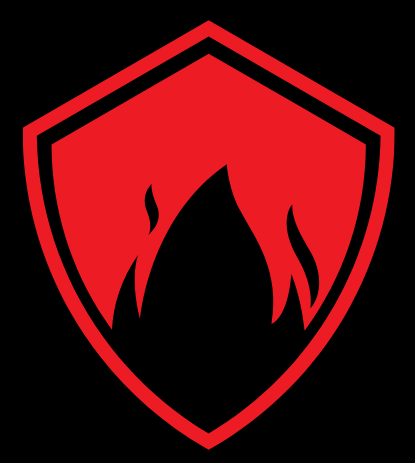

<h1 align="center">
  <a href="https://www.linkedin.com/in/%E2%84%8C%F0%9D%94%9E%F0%9D%94%AF%F0%9D%94%AF%F0%9D%94%A6%F0%9D%94%B0%F0%9D%94%AC%F0%9D%94%AB-%E2%84%9C%F0%9D%94%A6%F0%9D%94%A0%F0%9D%94%A5%F0%9D%94%9E%F0%9D%94%AF%F0%9D%94%A1%F0%9D%94%B0%F0%9D%94%AC%F0%9D%94%AB-%F0%9D%96%A2%F0%9D%96%A8%F0%9D%96%B2%F0%9D%96%B2%F0%9D%96%AF-%F0%9D%96%AE%F0%9D%96%B2%F0%9D%96%B6%F0%9D%96%A4-%F0%9D%96%AC%F0%9D%96%B2%F0%9D%96%BC-7a55bb158/"></a>
  <br>
  The Ars0n Framework dockerized - because some people want to watch the clouds burn ¯\_(ツ)_/¯

  <br>
</h1>

<h3>  DISCLAIMER:
  THIS IS A WORK IN PROGESS. THERE BE DRAGONS. YOU HAVE BEEN WARNED. THE STABLE RELEASE IS NEAR THOUGH! PR's WELCOME!
  DO NOT USE THIS IN PRODUCTION AND EVEN LESS ON A PUBLIC REACHABLE SERVER!  *Soon™*
  Before filing issues please check TODO.md for now.
</h3>
<h4 align="center">A Modern, Agile Framework for Bug Bounty Hunting on your OS of choice</h4>
<p align="center">
  <a href="#about">About</a> •
  <a href="#prerequisites">prerequisites</a> •
  <a href="#quickstart">quickstart</a> •
  <a href="#image_build">image_build</a> •
  <a href="#for-developers">container_run</a> •
  <a href="#for-developers">developers</a> •

  <a href="https://www.youtube.com/@rs0n_live">YouTube</a> •
  <a href="https://www.twitch.tv/rs0n_live">Twitch</a> •
  <a href="https://discord.gg/DPt6TUDGH">Discord</a>
</p>

## about

Howdy!  My name is Harrison Richardson, or `rs0n` (arson) when I want to feel cooler than I really am.  
The code in this repository started as a small collection of scripts to help automate many of the common Bug Bounty hunting processes I found myself repeating.
Over time, I built a simple web application with a MongoDB connection to manage my findings and identify valuable data points. 
After 5 years of Bug Bounty hunting, both part-time and full-time, I'm finally ready to package this collection of tools into a proper framework.

**The Ars0n Framework** is designed to provide aspiring Application Security Engineers with all the tools they need to leverage Bug Bounty hunting as a means to learn valuable, real-world AppSec concepts and make 💰 doing it! 
My goal is to lower the barrier of entry for Bug Bounty hunting by providing easy-to-use automation tools in combination with educational content and how-to guides for a wide range of Web-based and Cloud-based vulnerabilities. 
In combination with my YouTube content, this framework will help aspiring Application Security Engineers to quickly and easily understand real-world security concepts that directly translate to a high paying career in Cyber Security.  

In addition to using this tool for Bug Bounty Hunting, aspiring engineers can also use this Github Repository as a canvas to practice collaborating with other developers!  
This tool was inspired by Metasploit and designed to be modular in a similar way.  Each Script (Ex: `wildfire.py` or `slowburn.py`) is basically an algorithm that runs the Modules (Ex: `fire-starter.py` or `fire-scanner.py`) in a specific pattern for a desired result. 
Because of this design, the community is free to build new Scripts to solve a specific use-case or Modules to expand the results of these Scripts.
By learning the code in this framework and using Github to contribute your own code, aspiring engineers will continue to learn real-world skills that can be applied on the first day of a Security Engineer position.

My hope is that this modular framework will act as a canvas to help share what I've learned over my career to the next generation of Security Engineers!
Trust me, we need all the help we can get!!


## prerequisites

ansible  *Soon™*
latest docker & docker compose. 

refer to the ansible playbook to get yourself setup. *Soon™*

## quickstart

git clone --depth 1 https://github.com/R-s0n/ars0n-framework-dockerized

## image_build


`docker compose build`


## container_run
You can uncomment the two containers pertaining to DVWA in the docker-compose.yml and use localhost:4280 as target for testing.

`docker compose up -d && docker compose logs -f`

You can watch the logs or ctrl+c, the containers will continue to run because of the -d flag earlier.


## ui

Visit the browser UI @ 127.0.0.1:3000

### scripts

run scripts straight within the containers from your host *Soon™* 


#### wildfire

```
python wildfire.py --start --cloud --scan
```

#### slowburn

```
python slowburn.py
```


#### firestarter


#### firescanner


#### fire-spreader

How to scale this framework for massive internet-wide recon.

#### recon-ranger 


#### troubleshooting


*Soon™*

## utilities


*Soon™*

## developers

You can uncomment the two containers pertaining to DVWA in the docker-compose.yml and use localhost:4280 as target for testing.

`git clone https://github.com/R-s0n/ars0n-framework-dockerized
`
`docker-compose build
`
`docker compose -f docker-compose.dev.yml up -d --force-recreate && docker compose -f docker-compose.dev.yml logs -f
`


*Soon™*

## references & tributes


<h4 align="center">
🤠 Did you know that over 95% of scientists believe there is a direct correlation between the amount of coffee I drink and how quickly I can bake more features into this framework?  
Crazy, right?!  Well, now you can test their hypothesis and Buy Me a Coffee through this fancy button!!  🤯
<br>
<br>
<a href="https://www.buymeacoffee.com/rs0n.evolv3" target="_blank"></a>
</h4>
